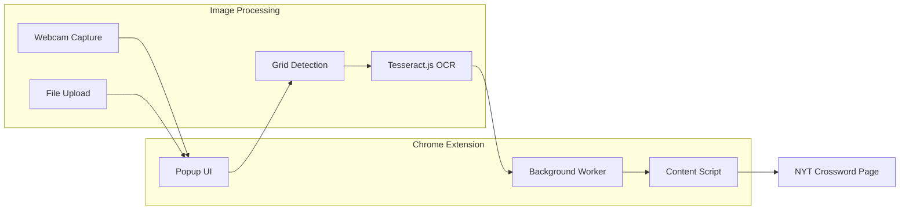

# NYT Crossword Paper Filler Extension

> **Original Prompt:**
> I love doing the NYT crossword but I can't track my streak or times because I like to print them out rather than do them on the app or online. I would like a web extension that solves both of these problems:
> - It takes a picture of the completed puzzle, scans it with OCR, loads it into memory, and then inputs it into the online web interface for the puzzle
> - It takes an amount of time for it to wait to input the last character, or 0 to bypass

## Architecture Overview



## Core Components

### 1. Extension Structure (Manifest V3)

- **manifest.json** - Extension configuration with permissions for activeTab, storage, webcam access
- **popup/** - HTML/CSS/JS for the extension popup UI
- **content/** - Content script injected into NYT crossword pages
- **background/** - Service worker for coordination
- **lib/** - Tesseract.js and image processing utilities

### 2. Popup UI Features

- Camera preview with capture button (webcam mode)
- File upload dropzone (upload mode)
- Image preview with detected grid overlay
- Editable grid showing OCR results (for corrections)
- Time delay input (seconds to wait before final letter, 0 to bypass)
- "Fill Puzzle" button to trigger input

### 3. Image Processing Pipeline

1. **Capture/Load Image** - From webcam or file upload
2. **Preprocessing** - Convert to grayscale, increase contrast, apply threshold for cleaner OCR
3. **Grid Detection** - Use edge detection to find the crossword grid boundaries and cell positions
4. **Cell Extraction** - Crop individual cells from the image
5. **OCR per Cell** - Run Tesseract.js on each cell, configured for single character recognition
6. **Result Assembly** - Build a 2D array of recognized letters

### 4. Training Data Collection

After the user reviews and confirms/corrects the OCR results, we save each cell image paired with its confirmed label:

- **Storage format**: Cell images saved as 28x28 grayscale PNGs (EMNIST-compatible)
- **Labeling**: JSON manifest mapping image filenames to confirmed letters
- **Location**: IndexedDB for browser storage, with export option to download as ZIP
- **Only save confirmed data** - captures corrections, not Tesseract guesses

This builds a personalized handwriting dataset over time, ready for CNN training on EMNIST architecture.

### 5. NYT Crossword Interaction

The user will manually place their cursor in the top-left cell before triggering fill. The NYT interface auto-advances to the next cell after each keystroke (skipping black squares automatically). This simplifies the content script to:

- Dispatch keyboard events for each letter in sequence (row by row, left to right)
- Skip black squares in the OCR data (the UI handles navigation)
- Apply the configured delay before the final character
- Type at a reasonable pace (small delay between keystrokes to avoid issues)

## Technical Considerations

### OCR Accuracy for Handwriting

Tesseract.js works best with printed text. For handwriting:

- Use heavy preprocessing (binarization, noise removal)
- Configure for single character mode (`--psm 10`)
- Train user to write clearly in CAPS
- **Include an edit step** - Show detected letters in a grid for user to correct before submitting

### Grid Detection Approach

1. Convert image to grayscale
2. Apply Canny edge detection
3. Use Hough transform to find horizontal/vertical lines
4. Identify grid intersections to locate cells
5. Alternative: Use contour detection if standard grid format

## File Structure

```
nyt-xword-paper-filler/
├── manifest.json
├── popup/
│   ├── popup.html
│   ├── popup.css
│   └── popup.js
├── content/
│   └── content.js
├── background/
│   └── background.js
├── lib/
│   ├── image-processor.js    # Grid detection, preprocessing
│   ├── ocr-worker.js         # Tesseract.js wrapper
│   ├── training-store.js     # IndexedDB storage for training data
│   └── dataset-export.js     # Export training data as ZIP
├── assets/
│   └── icons/                # Extension icons
├── docs/
│   └── PLAN.md               # This file
└── README.md
```

## Key Dependencies

- **Tesseract.js** (~4.1.1) - Local OCR engine
- **OpenCV.js** (optional) - For robust grid detection, or use canvas-based approach

## Limitations to Be Aware Of

- Handwriting accuracy will vary - the edit step is crucial
- Grid detection assumes a standard crossword layout
- NYT may update their web interface, requiring content script updates
- Works only with the web version at nytimes.com/crosswords

## Implementation Status

All components have been implemented:

- [x] Create manifest.json with required permissions
- [x] Build popup UI with webcam capture, file upload, grid preview, and controls
- [x] Implement image preprocessing and grid detection logic
- [x] Integrate Tesseract.js for single-character OCR on each cell
- [x] Create editable grid component for reviewing/correcting OCR results
- [x] Build content script to dispatch keyboard events in sequence
- [x] Implement configurable delay logic for final character input
- [x] Wire up message passing between popup, background, and content script
- [x] Implement training data collection - save confirmed cell images to IndexedDB
- [x] Add export feature to download training dataset as ZIP
